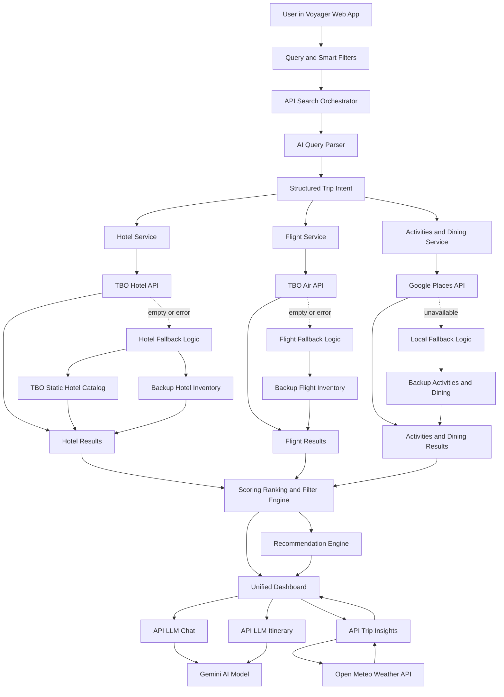

# Voyager Architecture Overview (Mermaid + Script)

Use this section before implementation demo.
Language is simple and judge-friendly.

## Mermaid Architecture

## Architecture Script (About 75 to 90 Seconds)
"Before I show implementation, let me explain Voyager architecture quickly.

First, user gives one travel query and smart filters in the web app.
This request goes to our search orchestrator.

Then AI query parser converts natural language into structured trip intent, like source, destination, days, budget, and preferences.

Using this intent, Voyager calls hotels, flights, and local experiences in parallel.
Hotels come from TBO Hotel API.
Flights come from TBO Air API.
Activities and dining come from Google Places.

After data comes in, our scoring and filter engine ranks the best options.
Then recommendation engine creates top trip combinations and sends output to one unified dashboard.

For intelligence, we have three extra services:
LLM chat for interactive help, itinerary API for day-wise plan, and trip insights API for weather and practical guidance.

Most important, we have fallback logic.
If any live API is slow, empty, or unavailable, Voyager switches to fallback inventory sources, so user journey does not break.

Now I will move to implementation and show this flow live in product."

## Short Transition Line
"Architecture is clear, now let us see how this works in real user flow."
